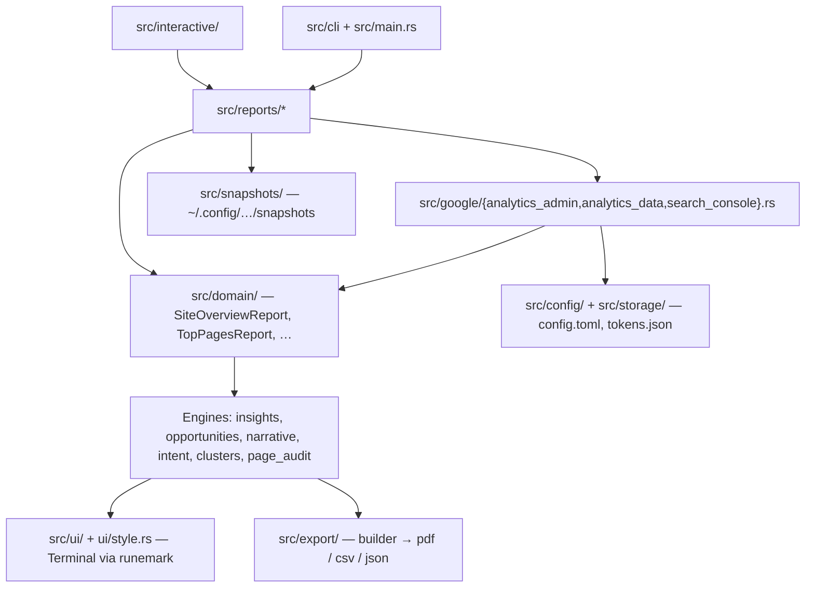

# Architecture

## Schichtenmodell

Die Anwendung ist als gerichtete Pipeline gebaut: Google-API → Mapping in interne
Domain-Modelle → Analyse-Engines → Darstellung. Google-Responses erreichen nie direkt
die Ausgabe.



## Verzeichnisstruktur

```
src/
├── main.rs            # Entry, Command-Dispatch, Orchestrierung je Report
├── cli/               # Clap-Definitionen (Command, ReportAction, ExportAction, …)
├── interactive/       # inquire-Menü (menu.rs) und Ersteinrichtung (setup.rs)
├── auth/              # OAuth: pkce, server (Redirect-Listener), refresh, credentials
├── storage/           # Token-Persistenz (tokens.json)
├── config/            # AppConfig: Properties, ReportConfig, ThresholdsConfig, Cluster
├── google/            # API-Clients + gemeinsamer Retry-/Timeout-Layer (mod.rs)
│   └── api.rs         # GoogleApi-Trait: die Naht zwischen Reports und Google
├── domain/            # interne Report- und Zeilenmodelle, serde-serialisierbar
├── reports/           # ein Modul je Report: baut Domain-Modelle aus API-Daten
├── insights/          # regelbasierte Insights auf Domain-Modellen
├── opportunities/     # Opportunity-Scoring + Action Plan
├── narrative/         # Management-Summary und Abschnittstexte (Prosa-Generator)
├── intent/            # Query-Intent-Klassifikation
├── clusters/          # Topic-Clustering (URL-, Query-, Config-basiert)
├── page_audit.rs      # Stärke-, Schwäche-, Isolations-Scores je Seite
├── snapshots/         # lokale Metrik-Snapshots für Trendvergleiche
├── helpers/           # geteilte Utilities (Datumsrechnung, URL-Matching, Merges)
├── ui/                # gesamte Terminal-Ausgabe (print_* je Report)
│   └── style.rs       # Farbpolitik: eine Console, Paint-Trait für alle Module
├── export/            # builder.rs → ViewModel, pdf.rs, csv.rs
└── errors/            # AppError + Result-Alias
```

## Google-API-Layer

`src/google/mod.rs` stellt den gemeinsamen Unterbau: `http_client()` mit 30-Sekunden-
Timeout und `send_with_retry()` mit bis zu drei Versuchen, exponentiellem Backoff und
Auswertung des `Retry-After`-Headers bei HTTP 429. Die drei Clients darüber
(`analytics_admin`, `analytics_data`, `search_console`) mappen ihre Responses direkt in
Domain-Typen und geben `errors::Result` zurück.

## Report-Schicht

Reports sprechen nicht direkt mit den HTTP-Clients, sondern über das
`GoogleApi`-Trait in `src/google/api.rs`. `build` ist generisch über
`&impl GoogleApi` und sieht nie ein Token: `HttpGoogleApi` redet mit Google,
`FixtureGoogleApi` (nur unter `#[cfg(test)]`) antwortet aus hinterlegten
Responses und macht die Schicht ohne Login testbar.

Jedes Modul unter `src/reports/` baut genau ein Domain-Modell:
`overview`, `top_pages`, `page_detail`, `compare`, `opportunities`, `queries`,
`ai_traffic`, `channels`, `clusters`, `decay`, `devices`, `countries`, `growth`,
`trends`, `site_health`.

GA4- und Search-Console-Daten werden dabei über `helpers::match_sc_url_to_path()` und
die `merge_sc_*_into_page_map()`-Funktionen auf Pfadebene zusammengeführt — GA4 liefert
Pfade, Search Console volle URLs.

## Analyse-Engines

Die Engines arbeiten ausschließlich auf Domain-Modellen, nicht auf API-Responses:

- **`insights/`** — mutiert Reports und hängt `Insight`-Einträge an; Schwellwerte
  kommen aus `ThresholdsConfig`, nicht aus Konstanten im Code.
- **`opportunities/`** — Score = Impact × Confidence / Effort, mit
  positionsabhängiger Erwartungs-CTR; gruppiert Ergebnisse je Keyword und leitet
  daraus einen `ActionPlan` ab.
- **`narrative/`** — regelbasierte englische Fließtexte (Management-Summary,
  Abschnittsinterpretationen) für Terminal und PDF.
- **`intent/`** — heuristische Klassifikation von Queries in informational,
  navigational, commercial, transactional; Brand-Terms aus der Config.
- **`clusters/`** — drei Strategien: URL-Pfadsegment, häufige Query-Terme, manuelle
  Config-Zuordnung.
- **`page_audit.rs`** — Scores und Klartext-Empfehlungen je Seite.

## Ausgabeschicht

Zwei parallele Senken auf denselben Domain-Modellen:

- `src/ui/mod.rs` — Terminal, eine `print_*`-Funktion je Report. Farbe und Symbole
  kommen ausschließlich über `ui::style::Paint` aus einer prozessweiten runemark-
  `Console`; Insights werden als runemark-`Report` gerendert (Gruppe je
  `InsightCategory`, Verdict aus der schwersten Severity).
- `src/export/` — `builder.rs` flacht die Domain-Modelle in ein `ReportViewModel` aus
  (alle Zahlen bereits als formatierte Strings), `pdf.rs` rendert daraus über
  `renderreport`/Typst, `csv.rs` schreibt einzelne Reports als CSV. JSON-Export
  serialisiert die Domain-Modelle direkt über serde.

## Konfiguration und lokaler Zustand

`AppConfig::load()` liest `~/.config/auditmyvisitors/config.toml` und fällt bei
fehlender Datei auf Defaults zurück (28 Tage, 20 Top-Pages, Standard-Schwellwerte).
`require_ga4_property()` / `require_search_console_url()` erzwingen eine Auswahl und
liefern sonst `AppError::NoPropertySelected`.

Snapshots (`src/snapshots/`) speichern je Property und Datum die Kernmetriken und
ermöglichen den Vergleich gegen den letzten Lauf, ohne erneut historische Daten zu
ziehen.
